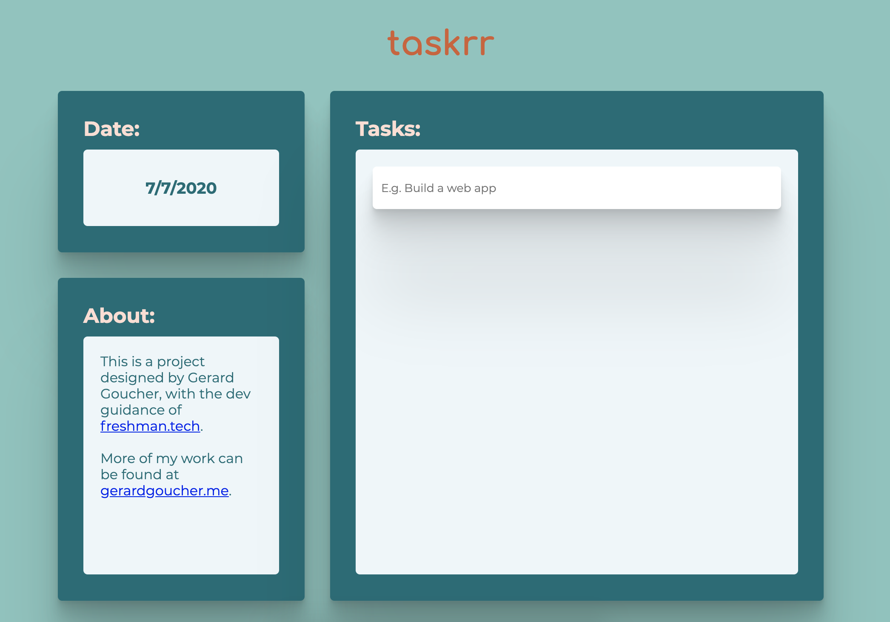
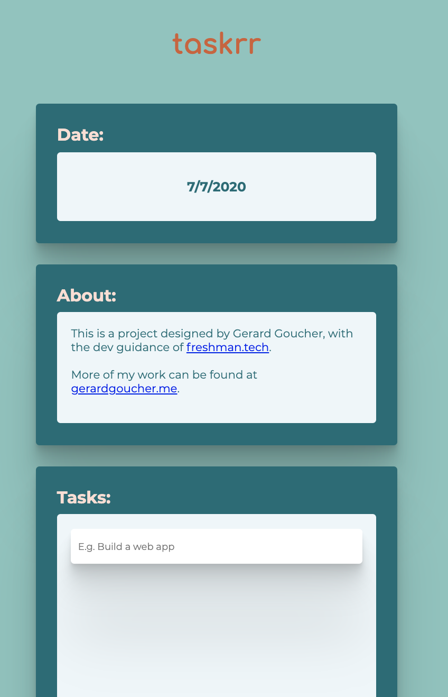

# Task Manager Project

👋 Hi! 

Thanks for coming to check out my project 🙂!

In this project, I wanted to hone my skills in responsive design, Sass, CSS Grid and Flexbox, psuedo-classes, and wanted to work on manipulating the DOM using JavaScript.

I decided to make a simple, elegant task manager to use in my spare time, and wanted it to be nice to look at. I consulted [freshman.tech](https://freshman.tech/todo-list/) for JavaScript reference, as I am still new to the techniques of adding event listeners and manipulating the DOM. While I certainly relied heavily on their guidance, I am now a lot more comfortable with event listeners and DOM manipulation.

## JavaScript

This was definitely the part of the project that was difficult for me, as I am familiar with programming languages and problem solving in them, but DOM manipulation was very new for me. Since so much of the JavaScript was burrowed from a [freshman.tech](https://freshman.tech/todo-list/) tutorial, I will not be featuring the code here, but through this project, I grew comfortable with the ```querySelector()``` method, learned how to use event listeners and target them to classes and their children elementers, and learned how to use DOM Manipulation to render changes on the client screen.

## Layout

This project relied heavily on the usage of CSS grid to make a responsive final product. This allowed me to easily create side content with tasks being the primary focus on the Desktop and Mobile site, in different layouts. 


### Desktop Layout



### Mobile Layout




### Sass Snippet

The following code was utilized to create the grid layout for the mobile and desktop sizes:

```
.content-wrap {
    margin: auto;
    max-width: 900px;
    display: grid;
    grid-template-columns: 1fr;
    grid-column-gap: $column-size; 
    /* $column-size == 30px */
    grid-row-gap: $column-size;
}

@media only screen and (min-width: 1000px) {
    .content-wrap {
        grid-template-columns: 1fr 2fr;
        grid-template-rows: 1fr 2fr;
        #tasks {
            grid-area: 1 / 2 / span 2 / span 1;
        }
    }
}
@media only screen and (max-width: 1000px) {
    .content-wrap {
        grid-template-rows: 1fr 1.3fr 3fr;
        max-width: 700px;
        height: 1200px;
        padding: 0% 10% 10% 10%;
    }
}
```

As seen above, ```grid-template-rows``` and ```grid-template-columns``` were adjusted accordingly to ensure proper layout ratios, and explicit sizing was utilied to ensure that their containers didn't grow too large, or in the case of mobile sizing, be too small. Breakpoints are designed to occur before there is too much content in the window, allowing for a smooth transition to the layout for mobile screens.

### Conclusion/Future Work

I learned so much from this project, and am really proud of what I've done. In the future, I'd definitely like to add additional functionality for task items, such as setting priority, adding due dates, and potentially turning this list into a collaborative platform.